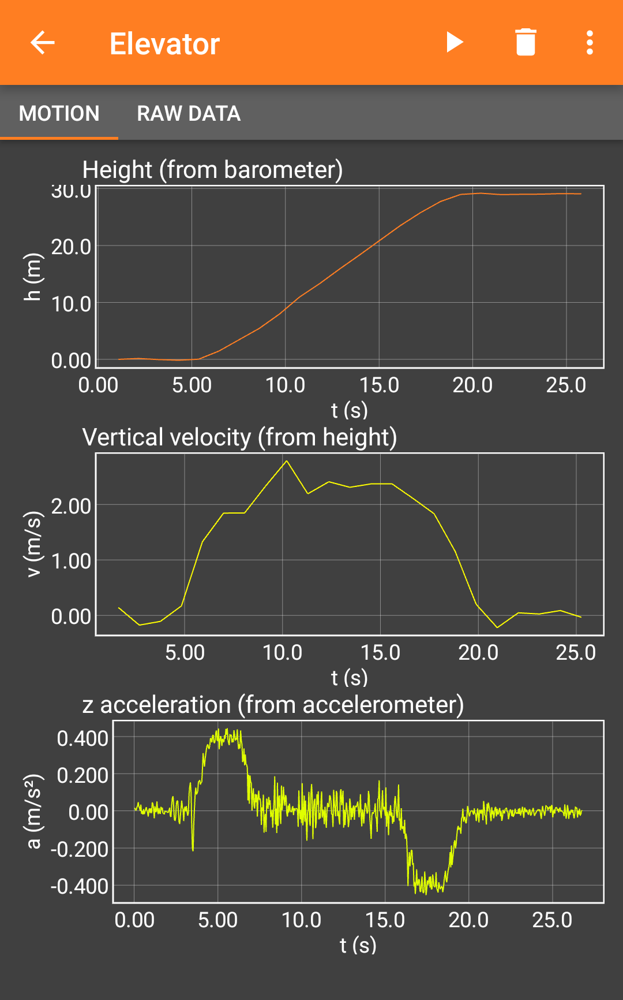

# phyphox Experiment Collection

This is the raw content of the phyphox experiment collection, which can be found at [phyphox.org/expdb](https://phyphox.org/expdb).

## Concept and structure

This repository is structured into languages, then document types and then individual documents. For example, you will find English files in the folder "en", which contains isntructions in "en/instructions" and the instructions for the elevator experiment in "en/instructions/elevator".

In each of this folders you will find a file `index.md` which is the main article in Markdown format (see below). Supporting files like images can be put in the same folder in any structure you like.

Each time a change has been commited to this repository (see "Using github" below), a script will automatically generate a webpage version as well as alternative formats (docx, pdf, etc.) of the entire experiment database and post a link to the generated data as a comment under the commit (the webpage should be available within seconds, the other files can take a few minutes).

Note that while this generated version is available online and publicly linked from the comment under the commit, official publications that are linked from phyphox.org have to be set manually.

## Using github

If you have not used github or git system before, this here is a very quick introduction to the concept. Git is a versioning system primarily used for source code. The idea is that any change made to source code (or in this case the Markdown documents) is not stored as an entirely new document, but as a list of changes towards the previous version. Changes to one or more files are bundled into so-called "commits", which should have a short summary message like "Added material secition to elevator experiment".

A typical workflow is editing the files locally, then bundling all changes into a commit and finally sending the changes to git (or github), which is called a "push". However, when you are reading this, it is very likely that editing the files online on github is the better alternative for you. When you are done editing a Markdown file, it will offer you to turn it into a commit, which in this context is similar to saving and will trigger the process of building a new version of the webpage.

Note that ideally, you try to bundle all work that belongs together logically into a single commit. This way it is easy to revert or "cherry pick" something. Suppose you are working on the elevator experiment while someone else is creating isntructions for a new experiment from a Bachelor thesis. You are ready with your version, but the experiemnt from the Bachelor thesis should wait for supporting files or another language version. If the Bachelor thesis experiment was pushed in only three commits ("First draft", "Fixing some typos", "Added material list"), it is easy to tell git to create a new version without these three commits, but if every single typo is fixed in its own commit, it becomes very tedious to create such a version.

Now, since you can only see the result after commiting, it will be rather difficult to get away without many small commits, so there is another trick to using git: Branches. If you expect to work on a larger chunk (like a new experiment), click on the dropdown menu above the file list (it probably reads "main" at the moment and should have "branches" and "tags" written to the right). This will show you a list of branches and allows you to simply type a new branch name and start from there. A branch is like a copy of the current set of files on which you can work independently. You can put as many commits into it as you like and when you are done, you can put your changes back into the main branch (a so-called "merge") and combine all your commits into a single commit (a so-called "squash"). Ask someone from the phyphox team when you are ready for a merge as this can be a bit confusing for the first time, but for now you can just create as many branches as you like and work on those without adding a commit for every single fixed typo.

## Metadata (frontmatter)

Every document format contains some metadata. These indicate the author, categories, sensors used in an experiment etc. If you are starting an entirely new document, you should copy the content from the appropriate type of document from the templates folder. For example, if you are writing instructions for an experiment about a portal gun, you should take the contents from `templates/instructions.md` and place them in `en/instructions/portalgun/index.md` as a starting point.

The front matter is in YAML format. In most cases it is enough to know that everything after a hash (#) is ignored and just used for instructions and you can simply go through the things you copied from the template and edit them intuitively following the additional info behind the hashes. Note that white spaces (especially the indentations from pressing the space bar), colons (:) and dashes (-) are important parts that make the data machine readable. If you run into problems here, ask someone from the phyphox team.

## Markdown, formulas and related

Below the frontmatter (i.e. after the dashes under the front matter) begins the main document. Here you can freely formulate your article and structure it in the markdown format.

Markdown is a very simple language to format text. Here are some basic examples:

### Headlines / sections / Paragraphs

Paragraphs are simply created by writing the text as plain text in a single line. You should not try to manually introduce line breaks, but just keep on writing on a single line.

If you want to add a new paragraph like this one, you leave an empy line between two paragraphs.

Headlines are created by adding a hash in front of a line (note: entirely different function than in the frontmatter / metadata). By adding more hashes you add a headline for subsections or subsubsections. Here is an example:
```
# Main headline
## Subsection headline
### Subsubsection headline
```
This produces the following output:

---

# Main headline
## Subsection headline
### Subsubsection headline

---


Note that there is no automatic numbering. This is all just formatting. Also note that some markdown parsers accept a missing space after the hashes, but this is not guaranteed everywhere, so you should add a space between the hash and the headline.

### Bold / italic

Emphasizing parts of your text can be done by making parts bold or using italics as follows:
```
This text contains *italics*, **bold words** and even parts that are both, ***bold and italic***.
```
This produces the following:

---

This text contains *italics*, **bold words** and even parts that are both, ***bold and italic***.

---
Note that the number of asterisks (*) change the level of emphasis. A single asterisk leads to italics, two lead to bold text and three to a combination of both. Also note, that you can use underscores instead of asterisks, but be careful of using them inside a word to only emphasize a part of it as sometimes underscores are not interpreted if they are not surrounded by spaces.

### Blocks and code

You might have noticed that I put the output of the examples above between horizontal lines. These can be created by three dashes on their own line:
```

---

```

Note, that the line above and below these dashes should remain empty as dashes can be used as an alternative to turn the line above them into a headline.

Another method to structure sections is putting them into blocks. A common example is a blockquote which is created like this:
```
> This is a blockquote
>
> It can even have multiple paragraphs
```
This produces the following:

---

> This is a blockquote
>
> It can even have multiple paragraphs

---

If you want to put source code into your text, you might prefer a code-like formatting (i.e. a monospace font). This can be done by putting the code between two backticks (`).

This can be done `inline` (i.e. as part of an ongoing text) or as a block. The word inline was produced like this:
```
This can be done `inline`
```

Usually, when putting it into a block you want to start the block with three backticks on their own line and end it with three more backticks on their own line. The reason is that using multiple backticks allows you to use single backticks in your code without signalling that the blocks ends there. You simply close the block with as many backticks as you used to open it:
````
```
this.is(some);
code();
```
````

This produces the following:

---

```
this.is(some);
code();
```

---


### Lists

Creating lists can be done by starting an item of the list with a special character or number followed by a space. If you keep the following text indented you can even put additional paragraphs in the same item. Here is an example of a simple unordered list with several items, some of which have multiple paragraphs:
```
- This is a simple unordered list
- It contains multiple items
- Some items can even have multiple paragraphs

  See? I am another paragraph in the same item.
- You can also nest lists
  - For example, I am an item of a list in a list
  - I am the second one in that list in a list
- And I am an item back in the outer list.
```

This produces the following:

---

- This is a simple unordered list
- It contains multiple items
- Some items can even have multiple paragraphs

  See? I am another paragraph in the same item.
- You can also nest lists
  - For example, I am an item of a list in a list
  - I am the second one in that list in a list
- And I am an item back in the outer list.

---

Note that there are several symbols that can be used instead of the dashes like an asterisk (*) or a plus sign (+), but they all produce the same output.

You can also use numbers followed by a period to produces "ordered lists" with numbers instead of bullet points:
```
1. Item one
2. Item two
5. Item three
```

This produces the following:

---

1. Item one
2. Item two
5. Item three

---

Note that the actual number does not matter. In markdown the third item started with the number 5, but it produces a list item with the number 3. You can just start any item with "1." and let markdown handle the numbering if you prefer.

### Links and images

Links and images are two very different things, but their syntax is confusingly similar, so look closely at the following examples.

A link consists of the URL to which the link should point and the text that is shown as a link. For example, a link to the forums on phyphox.org could be formatted as follows:
```
[phyphox forums](https://phyphox.org/forums)
```
This produces the following:

---

[phyphox forums](https://phyphox.org/forums)

---
So, "phyphox forums" is the visible text while the full URL (including https://) goes into the parantheses.

Images work similar with the only difference that they have an exclamation mark at the beginning and that the text part is not visible but used as the "alt text". This text is not visible if the image is shown properly, but it will be shown instead of the image in case of a problem or for users who cannot see images (because of the device they are using or more likely because of impared vision). So, you should make it a habbit to fill in something as an alt text that explains what the image would show.

```

```

This produces the following:

---


---

There are several things to note here:
- The alt text is not an image caption. It should not add additional information, but describe the image or provide the same information as the image. (In fact, the example above is bad, but used here for brevity.)
- There are no formatting tools to create captions, to resize the images or to let the text flow around them. The reason is that this needs to be translated into print formats (PDF) as well as screen formats (the webpage) and into technically different formats (like docx). There is no simple unified way to do this, but some tools to give hints about the preferred formatting will be added in the future. For now it is absolutely ok if the image is not placed elegantly. Simply include it at an appropriate location and add a caption as a paragraph in italics (see above) below it.
- The URL to an image should be a relative path. While absolute paths (i.e. ones starting with https://) work in this preview here, they will break if the document is converted alter.
- The URL should be relative to the Markdown document. I.e. in the example above the image is in `en/instructions/elevator/elevator-example.png` because this readme file is in the root folder. However, if you want to reference this image from the index.md file in `en/instructions/elevator/` the file `elevator-example.png` is just next to it and you should only use `elevator-example.png` as a URL (without the `en/...` part).

### Other formatting options

There are none. Well, technically, this is not entirely true as Markdown supports embedding HTML, but you should avoid using more than the things listed above, so the document can be consistently transformed into different formats. If you want to create a perfectly designed worksheet, you can do so in the desired target format (like creating it in Word), but there is no way to automatically have it look the same in HTML or other formats. That's why these simple instructions here are only using basic formatting.

If there is a certain kind of formatting that you think would translate nicely into all format, get in touch with someone from the phyphox team, so we can see if we can add it.

**Also be aware that github also renders Markdown and even shows previews while typing, it is not identical to the Markdown tools used for automatic conversion, so please check the output that is automatically generated from your commits.**

### Formulas

Mathematical formulas are an example for something that has been added on top of makrdown that is understood by all of our formats. You can include LaTeX formulas anywhere in your document by using the bracket notation, i.e. `\[` and `\]`. These can be used anywhere include inline in paragraphs:

```
This is a sentence with the formula \[\sqrt(x)\] used inline.
```

This produces the following:

---
This is a sentence with the formula $\sqrt(x)$ used inline.

---
(*Warning: This preview is cheating a little as github requires dollar signs to signal LaTeX formulas while our tools use the brackets as shown above.*)

Display formulas, i.e. formulas that stand on their own, can also be added with two dollar signs, but remember that **dollar signs will not work for inline formulas**.

```
$$
a^2 + b^2 = c^2
$$
```

This produces the following:

---
$$
a^2 + b^2 = c^2
$$

---

### Videos

Since there are several instruction videos hosted on Youtube, we have added a shortcode to embed these videos:
```

```
This embeds a video on Youtube that can be found at https://www.youtube.com/watch?v=y-goBtfuXAM

Note, that at the moment this only works for the webpage version and will just write the full URL for other formats. Please let us know if you need something else here.


