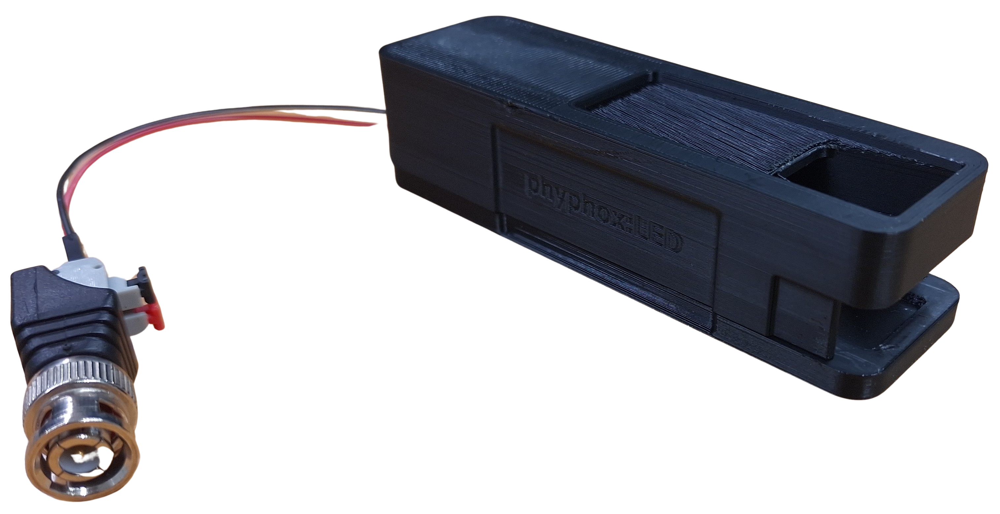
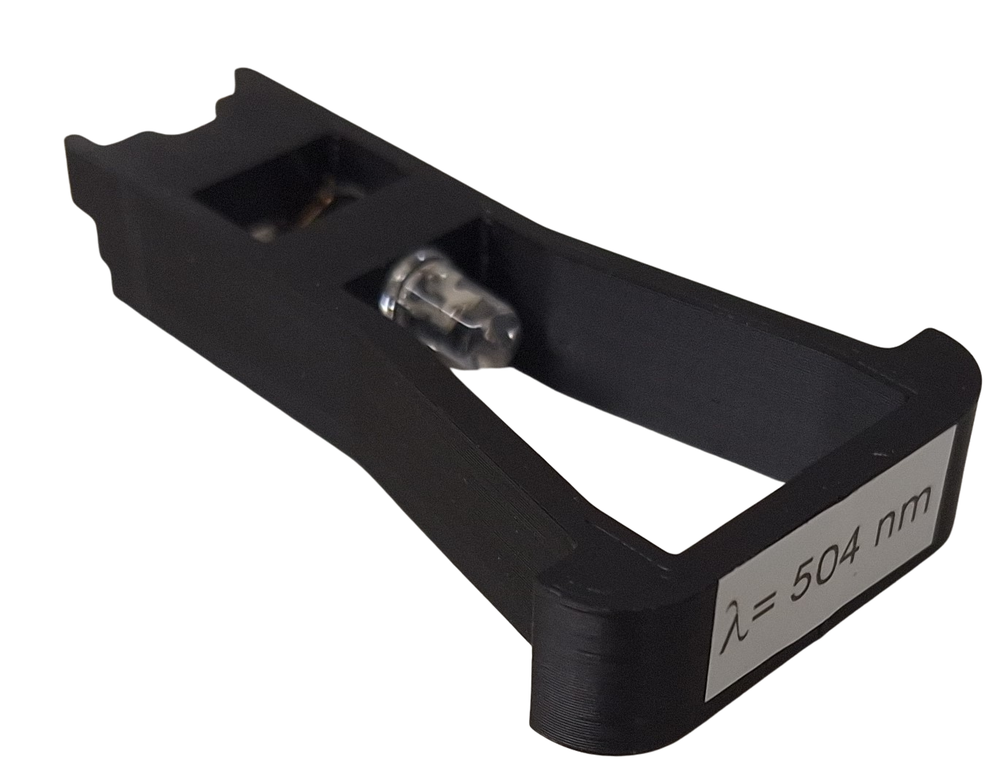
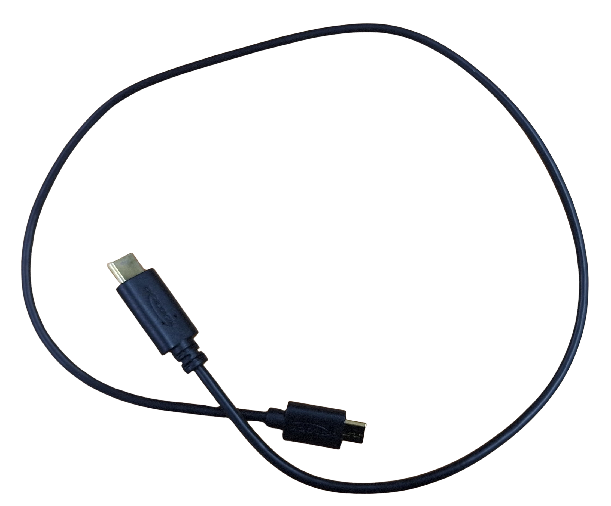
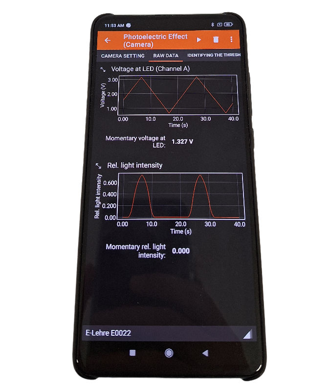
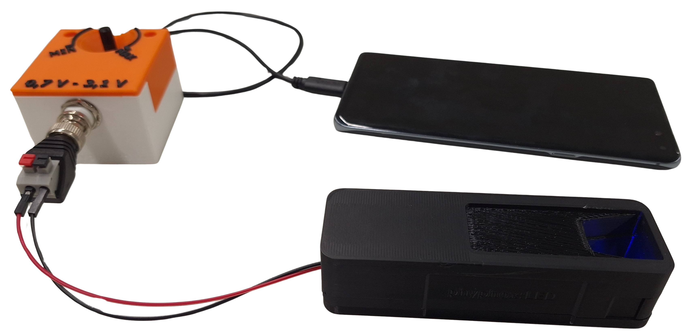

## Aufbau und Durchführung
# Material
| | | |
|:-------------------------:|:-------------------------:|:-------------------------:|
| *phyphox*:h-Box |  Abdunklungsbox |  Stabilisierungshocker |
| Verschiedene LED-Einsätze |  Anschlusskabel |  Smartphone |

# Aufbau
1. Ladet euch das *phyphox*-Experiment **PLA** (Planck'sches Wirkungsquantum) mit dem untenstehenden QR-Code herunter.
   - Öffnet *phyphox*.
   - Klickt auf das Plus-Symbol.
   - Wählt "Neues Experiment von einem QR-Code"aus.
   - Scannt den untenstehenden QR-Code ein.
2. Schließt die Abdunklungsbox an die *phyphox*:h-Box an.
3. Schließt die *phyphox*:h-Box an die Spannungsquelle an (z.B. das Smartphone).

{width=20%}

# Durchführung
1. Öffnet das *phyphox*-Experiment **PLA**.
2. Wählt eure *phyphox*:h-Box (Nummerierung an der Seite) aus. \[\Rightarrow\] Nun verbindet sich die Box mit der App und sendet den Wert der angelegten Spannung.
3. Platziert euer Smartphone so auf der Abdunklungsbox, dass sich die Kamera direkt über dem Reflexionsmaterial (weiß) befindet. Nutzt ggf. den bereitsgestellten Hocker zur Stabilisierung des Smartphones.
---
4. Setzt einen LED-Einsatz in die Abdunklungsbox ein.
5. Stellt den Spannungsregler auf der *phyphox*:h-Box auf das Maximum. Stellt den Auswahlbereich der Kamera so ein, dass *nirgendwo überbelichtet* wird (d.h. der Auswahlbereich darf *keine rot markierten Stellen* enthalten).
6. Dreht den Spannungsregler zurück und wechselt auf den Reiter "Bestimmen der Schwellenspannung".
7. Startet die Messung.
8. Nehmt durch *langsames* Drehen des Spannungsreglers eine LED-Kennlinie auf. *Alternativ könnt ihr auch den Sägezahn-Modus ausprobieren, bei dem die Kennlinie automatisch von links nach rechts abgefahren wird*.
9. Pausiert die Messung, wenn ihr eine brauchbare Kennlinie aufgenommen habt.
10. Platziert die grüne Ausgleichsgerade in der Kennlinie durch *Anpassung der minimalen und maximalen berücksichtigten Intensität*. Die Ausgleichsgerade soll durch den linearen Bereich der Kennlinie verlaufen.
11. Notiert euch die vom Experiment berechnete Schwellenspannung \[U_\mathsf{Schwelle}\] auf dem Auswertungsbogen. Notiert euch auch die zugehörige Unsicherheit. Gebt anschließend die Wellenlänge im Experiment ein und speichert das Wertepaar *Wellenlänge*-*Schwellenspannung* im Experiment ab. Das Wertepaar ist anschließend im Reiter "h-Bestimmung" verfügbar.
12. Löscht die aufgenommenen Messdaten durch Wahl des entsprechende Buttons und fangt mit der nächsten LED bei Schritt 4 an.

# Auswertung
1. Berechnet aus den Schwellenspannungen die Photonenenergien (mit Unsicherheiten).
*Erinnerung*: \[e=1.602\cdot 10^{-19}\,\mathrm{C}\]
2. Tragt die erhaltenen Frequenz-Energie-Wertepaare in das zugehörige Diagramm auf dem Auswertungsbogen ein (mit Unsicherheiten).
3. Zeichnet eine Ausgleichsgerade in das Diagramm ein und bestimmt deren Steigung. Welche physikalische Bedeutung hat die Steigung?
4. Zeichnet jeweils die Gerade minimaler und maximaler Steigung (im Rahmen der Unsicherheiten) in das Diagramm ein.
5. Berechnet die Unsicherheit auf den Messwert für das Planck'sche Wirkungsquantum.

# Probleme und Lösungen
- **Die Bluetooth-Verbindung bricht ab** Die App *phyphox* schließen und das *phyphox*-Experiment neu starten.
- **Die Kennlinie zeigt eine Hysterese** Dies ist häufig der Fall, wenn die Spannung zu schnell variiert wird. Messkurve durch Wahl des entsprechenden Button löschen und die Messung noch einmal neu starten.

# Arbeitsblätter / Material
- Auswertungsbogen zum Experiment: [pdf](files/h-Bestimmung_Auswertung.pdf)
