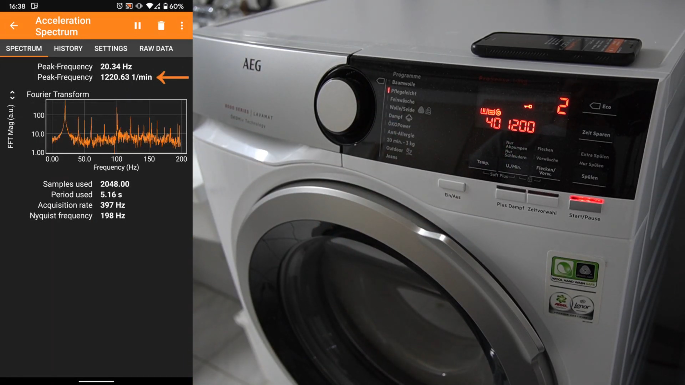
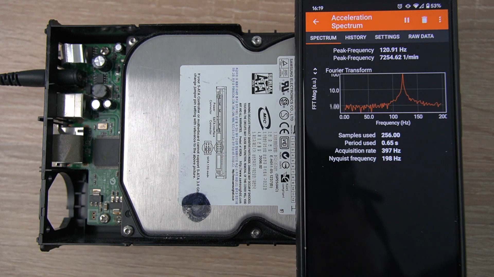



## Überblick

Diese Anleitung beschreibt verschiedene Möglichkeiten, um mit phyphox Drehzahlen zu bestimmen. In diesem Fall handelt es sich weniger um ein eigenständiges Experiment als um ein Werkzeug, welches zur Auswertung anderer Experimente, aber auch für Alltagsanwendungen genutzt werden kann.

Zur Bestimmung der Drehfrequenz können der Beschleunigungssensor, das Magnetometer, das Mikrofon oder die Kamera genutzt werden. Alle vier Varianten hängen davon ab, welches Objekt bzw. Gerät gemessen werden soll, wie hoch die Drehfrequenz ist und welche Auflösung benötigt wird.

{width=80%}

### Abgedeckte Themen

Aus physikalischer Sicht, wird hier kein Experiment vorgegeben. Es handelt sich viel mehr um ein Messwerkzeug, welches mit einer Vielzahl von Experimenten für verschiedene Altersstufen und Themengebiete eingesetzt werden kann. Die Methode selbst kann aber ebenso Gegenstand des Unterrichts sein. So können die hier genannten Beispiele als Veranschaulichung der Fourier-Transformation genutzt werden und auch deren Grenzen bzw. Besonderheiten wie den Alias-Effekt aufweisen.

### Benötigte Materialien

Für die hier vorgestellten Methoden ist nur das Smartphone selbst notwendig. Je nach Kontext und Sensor kann ein Dauermagnet (Messung mit Magnetometer) oder ein Stativ (Messung mit Kamera) eine nützliche Ergänzung sein. Hinzu kommt aber in allen Fällen der zu vermessende Aufbau bzw. die zu vermessende Apparatur.

### Zeitaufwand

Die Ergänzung einer Drehzahlmessung mit phyphox kann innerhalb weniger Minuten erfolgen. Je nach Methode kann es jedoch Zeit erfordern, die ideale Messposition, die ideale Methode und/oder die richtigen Parameter zu finden, so dass es in der Regel sinnvoll ist, die Methode zuvor einmal zu testen.

## Aufbau

Der Aufbau richtet sich nach der physikalischen Größe, über die die Drehzahl ermittelt werden soll.

### Messung mittels Beschleunigungssensor

Wenn die zu messende Drehbewegung eine Vibration erzeugt, selbst wenn es sich um eine sehr schwache Vibration handelt, bietet sich die Messung über den Beschleunigungssensor an. Hierzu muss das Handy lediglich so platziert werden, dass es leicht mitvibrieren kann. Es kann auf das zu messende Gerät gelegt werden (z.B. Waschmaschine oder Festplatte) oder auch auf dem gleichen Tisch liegen. In der Regel entspricht die Vibrationsfrequenz der Drehzahl. Ausnahmen stellen Verbrennungsmotoren dar, bei denen nicht die Vibration der Umdrehungen, sondern die Takte der einzelnen Zylinder die Messung dominieren und dadurch eine vielfache Frequenz ermittelt wird.

Die höchste messbare Frequenz richtet sich nach der halben Abtastrate des Beschleunigungssensors im jeweiligen Smartphone-Modell. Typisch messbaer Drehfrequenzen sind hier 50 Hz (3.000 1/min) bei iPhones bis zu 250 Hz (15.000 1/min) bei vielen Android-Modellen.

{width=80%}

### Messung mittels Magnetometer

Reicht die Vibration nicht aus oder kann das Smartphone nicht sinnvoll am Ort der Vibration platziert werden, bietet sich eine magnetische Messung an. Hierzu muss mit der Drehbewegung eine periodische Änderung des Magnetfelds auftreten. Dies ist beispielsweise bei Elektromotoren aufgrund der Bauweise gegeben, kann aber auch durch ein magnetisieren ferromagnetischer Teile des Aufbaus (z.B. metallische Arme eines Fidgetspinners) oder durch das Anbringen eines kleinen Magneten (wie bei Fahrradcomputern in den Speichen üblich) bei vielen Experimenten leicht ergänzt werden. Je nach Stärke des Magnetfelds kann sich das Smartphone in einem deutlichen Abstand zur Drehbewegung befinden. Zu beachten ist, dass die meisten Magnetometer im Smartphone bei wenigen Millitesla sättigen, was zu stärkerer Ausbildung von Obertönen im Spektrum führen kann (siehe Probleme und Lösungen unten). Hier sollten Magnet und Abstand des Handys sinnvoll gewählt werden.

Die höchste messbare Frequenz richtet sich nach der halben Abtastrate des Magnetometers im jeweiligen Smartphone-Modell. Typisch messbaer Drehfrequenzen sind hier 25 Hz (1.500 1/min) oder 50 Hz (3.000 1/min).

### Messung mittels Mikrofon

Auch das Mikrofon bietet sich zur Messung der Drehzahl an, sofern die Drehbewegung ein Geräusch erzeugt, welches über den Umgebungsgeräuschen liegt. Dies ist in der Regel der Fall, wenn man bei Änderungen der Drehzahl eine Änderung der Tonhöhe des hörbaren Geräuschs wahrnimmt. Das Handy sollte idealerweise mit dem Mikrofon zum Aufbau ausgerichtet sein und nicht auf einem Untergrund liegen, über den andere Geräusche übertragen werden.

Die höchste messbare Frequenz richtet sich nach der halben Abtastrate des Mikrofons. Diese beträgt bei nahezu allen Smartphones 48.000 Hz, was theoretisch die Messung von Drehzahlen bis 24 kHz ermöglicht. In der Praxis begegnet man eher dem Problem, dass niedrige Frequenzen nicht gut aufgenommen werden können und dass die eine hohe relative Frequenzauflösung bei derart hohen Abtastraten eine sehr hohe Anzahl Datenpunkte erfordert, weswegen das Mikrofon eher dann zum Einsatz kommen sollten, wenn die zu messenden Drehzahlen zu hoch für den Beschleunigungssensor sind.

### Messung mittels Kamera

Ist die Drehbewegung sichtbar, bietet die Kamera des Smartphones gegebenenfalls eine einfache Alternative zur Messung der Drehzahl. Hierzu muss es eine Stelle geben, deren Helligkeit sich mit dem Drehwinkel periodisch ändert. Ist dies nicht in ausreichendem Maße gegeben, kann in der Regel leicht mit einem Stift oder einem Klebestreifen eine sichtbar Markierung ergänzt werden. Das Handy sollte sich zudem auf einem Stativ befinden, da die Messposition innerhalb des Kamerabildes fest eingestellt werden muss.

Die höchste messbare Frequenz richtet sich nach der halben Bildrate der Kamera im jeweiligen Smartphone-Modell. Relevant ist hierbei nicht die höchste Bildrate für Zeitlupenvideos, sondern die höchste Bildrate, mit der das Handy einer App Bilder zur direkten Auswertung zur Verfügung stellen kann. Bei iPhones können so 200 Bilder pro Sekunde erreicht werden, was einer Drehzahl von 120 Hz (7.200 1/min) entspricht. Bei Android liegt das Limit derzeit bei 60 Bildern pro Sekunde und einer Drehzahl von 30 Hz (1.800 1/min).

## Durchführung

Für die jeweils gewählte Messmethode wird die zugehörige Messkonfiguration in phyphox geöffnet, welche ein Spektrum der gemessenen Werte darstellt (siehe folgende Unterabschnitte). Die Messung wird mit dem Dreieck oben rechts in phyphox gestartet. Alle Messkonfigurationen zeigen das momentante Frequenzspektrum, in welchem die Drehzahl als Maximum auftreten sollte. Auf einem weiteren Tab wird zudem der zeitliche Verlauf des Spektrums sowie der zeitliche Verlauf der dominierenden Frequenz dargestellt. Durch die Auswahl einer höheren oder niedrigeren Anzahl genutzter Datenpunkte im Tab "Einstellungen" kann der Kompromiss aus Reaktionszeit und Frequenzauflösung optimiert werden (mehr dazu im Abschnitt Ergebnisse).

### Messung mittels Beschleunigungssensor

Die Messkonfiguration für eine Drehzahlbestimmung mittels Beschleunigungssensor befindet sich unter "Werkzeuge"->"Beschleunigungs-Spektrum".

### Messung mittels Magnetometer

Die Messkonfiguration für eine Drehzahlbestimmung mittels Magnetometer befindet sich unter "Werkzeuge"->"Magnetfeld-Spektrum".

### Messung mittels Mikrofon

Die Messkonfiguration für eine Drehzahlbestimmung mittels Mikrofon befindet sich unter "Akustik"->"Audio-Spektrum".

### Messung mittels Kamera

Die Messkonfiguration für eine Drehzahlbestimmung mittels Kamera befindet sich unter "Kamera"->"Kamera-Spektrum: Helligkeit".

## Ergebnisse

Alle hier vorgestellten Messkonfigurationen führen eine Fouriertransformation der Sensordaten durch. Dies bedeutet, dass das gemessene Signal in eine Überlagerung von Sinusfunktionen verschiedener Frequenzen zerlegt wird. Das angezeigte Spektrum entspricht dem Amplitude der Sinusfunktion einer bestimmten Frequenz im Gesamtsignal.

Für viele Messungen genügt es, im Spektrum die Frequenz mit der höchsten Amplitude abzulesen. Wichtig ist jedoch, die Grenzen zu kennen, innerhalb derer dies zutrifft.

Die Frequenz-Achse des Fourier-Spektrums verläuft immer von 0 Hz bis zur Hälfte der Abtastrate $f$ des Ausgangssignal. Misst man beispielsweise mit einem Beschleunigungssensor mit einer Abtastrate von \(f = 400\,\mathrm{Hz}\), erhält man ein Frequenzspektrum von 0 Hz bis 200 Hz (siehe [Abtasttheorem](https://de.wikipedia.org/wiki/Nyquist-Shannon-Abtasttheorem)). Da die Abtastrate durch das jeweilige Gerät begrenzt ist, hat man hierauf wenig Einfluss.

Die Anzahl der Punkte auf der Frequenz-Achse entspricht hierbei der Hälfte der aufgezeichneten Messwerte \(N\). Nimmt man im obigen Beispiel also 256 Datenpunkte auf, werden die 200 Hz durch 128 Punkte im Spektrum abgedeckt. Dies bestimmt die spektrale Auflösung, welche somit der Abtastrate geteilt durch die Anzahl der Messpunkte entspricht \(\Delta f = f/N\). Im Beispiel liegen die Punkte im Spektrum somit im Abstand von etwa 1,56 Hz.

Beachtet man, dass die Dauer zum Aufzeichnen einer Anzahl von Messwerten \(T = N/f\) entspricht, kann man auch feststellen, dass die spektrale Auflösung dem Kehrwert der Messdauer entspricht \(\Delta f = 1/T$\). Im Beispiel dauert es 0,64 s um 256 Datenpunkte zu erhalten, was dem Kehrwert des Abstands der Datenpunkte im Spektrum von 1,56 Hz entspricht.

Hieraus ergibt sich ein Kompromiss aus Reaktionszeit der Messung und der Frequenzauflösung. Misst man eine konstante Drehzahl, kann eine sehr hohe Anzahl von Datenpunkten gewählt und so eine hohe Auflösung erzielt werden. Möchte man jedoch eine sich verändernde Drehzahl messen, muss die Anzahl der Punkte so gewählt werden, dass Änderungen schnell genug erfasst werden, zugleich aber die Frequenz noch genau genug bestimmt werden kann.

Darüber hinaus gibt es noch einige Eigenheiten der Fouriertransformation zu beachten, wenn die zu messende Drehzahl über das Spektrum hinaus geht oder das Messsignal nicht sinusförmig ist. Hierzu mehr unter "Probleme und Lösungen".

## Probleme und Lösungen

Da es sich bei diesem Versuch vor allem um eine Fouriertransformation eines Messsignals eines beliebigen Versuchsaufbaus handelt, beschränken sich die Problembetrachtungen hier auf die möglichen Probleme der Fouriertransformation.

### Mehrere Frequenzen sichtbar

Das Fourier-Spektrum entspricht einer Zerlegung des Messsignals in die Überlagerung von Sinus-Funktionen. Wenn das Messsignal jedoch nicht sinusförmig ist, kann es nicht durch ein einziges Sinus-Signal repräsentiert werden. Statt dessen sieht man typischerweise eine Sinusfunktion bei der Grundfrequenz des Messsignals und zusätzliche Spitzen im Spektrum, welche Sinus-Funktionen mit höherer Frequenzen entsprechen, deren Periodendauer ein Bruchteil der Periodendauer des Grundtons entspricht. Dies entspricht dem Phänomen von Obertönen bzw. Harmonischen. Zur Drehzahlbestimmung können diese höheren Frequenzen ignoriert werden. Bei extrem vom Sinus abweichenden Messsignalen (beispielsweise ein Magnet in den Speichen eines Fahrrads oder eine kleine Farbmarkierung an einem großen Rad für Messungen mit der Kamera), können diese höheren Frequenzen jedoch sehr dominant sein, so dass gegebenenfalls Vorsicht geboten ist, die Grundfrequenz nicht zu übersehen.

{width=80%}

### Langsame Drehungen

Liegt die Drehzahl weit unter der Abtastrate des Sensors, kann die Eigenschaft der Fouriertransformation, dass die spektrale Auflösung dem Kehrwert der Messdauer entspricht, problematisch oder zumindest ineffizient sein. Einerseits werden hier enorm viele Datenpunkte verarbeitet und andererseits handelt es sich hier oft um Messungen, bei denen die Repräsentation als Sinusfunktion von Nachteil ist gegenüber einer einfachen Zeitmessung zwischen zwei Ereignissen. In solchen Fällen stellen die jeweiligen Stoppuhrfunktionen in phyphox eine gute Alternative dar.

Möchte man beispielsweise die Drehzahl eines sich sehr langsam drehenden Fahrradreifens bestimmen, indem man eine Stelle mit einem hellen Klebestreifen markiert, erhält man in Folge ein Spektrum, in welchem die Drehzahl nahe 0 Hz liegt und das Spektrum aufgrund des deutlich vom Sinus abweichenden Signals mit vielen Obertönen überlagert ist. Zudem müssen für eine sinnvolle Frequenzauflösung vergleichsweise viele Umdrehungen gemessen werden. Die Stoppuhrfunktion hingegen misst die Zeit zwischen dem Überschreiten einer vorgegebenen Schwelle und kann so aus einer einzelnen Umdrehung gut eine genaue Zeitperiode bestimmen. Die Stoppuhrfunktionen in phyphox bieten hier einen Tab "Viele", der es erlaubt, eine unbegrenzte Zahl solcher Intervalle zu erfassen und auch eine mittlere Rate (in dem Fall die Drehrate) zu ermitteln.

### Zu schnelle Drehungen

Liegt die zu messende Frequenz oberhalb der halben Abtastrate des Sensors, kann diese Frequenz unter einem falschen Wert dennoch im Spektrum auftauchen. Dies ist der sogenannte [Alias-Effekt](https://de.wikipedia.org/wiki/Alias-Effekt). Durch diesen Effekt können Spektren entstehen, die nach einer gelungenen Messung aussehen, aber einen vollkommen falschen Wert liefern, weswegen man sich über die Größenordnung der zu messenden Frequenz gegenüber der Abtastrate des Sensors bewusst sein sollte. (Siehe Angaben zu Messbereichen im Abschnitt "Aufbau" zum jeweiligen Sensor.)

{width=80%}

### Zu geringe Frequenzauflösung

Um eine höhere Frequenzauflösung zu erreichen, muss die Anzahl der berücksichtigten Datenpunkte im Tab "Einstellungen" erhöht werden. Dies stellt jedoch immer einen Kompromiss gegenüber der Reaktionszeit des Spektrums dar. (siehe Abschnitt "Ergebnisse")

## Weitere Videos

Das oben eingebundene Video ist Teil einer Reihe von drei Videos über die Frequenzanalyse mit phyphox. Die Reihe beschränkt sich nicht auf Drehbewegungen und umfasst Mikrofon, Magnetometer und Beschleunigungssensor.

Teil 1: Audio (Vor allem Musikinstrumente, teils aber auf Drehungen übertragbar)



Teil 2: Magnetismus



Teil 3: Beschleunigung (bereits oben verlinkt)


