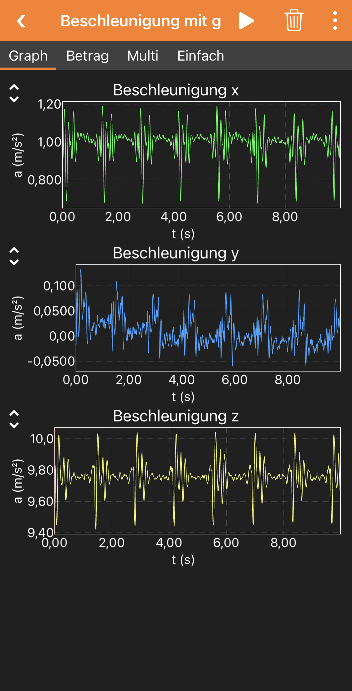
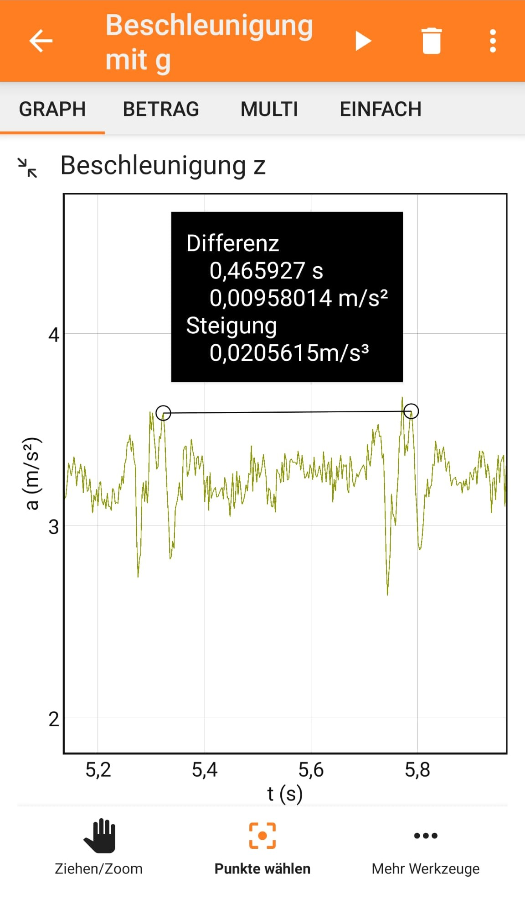

## Überblick

Das Beschleunigungsmessgerät des Telefons ist empfindlich genug, um einen Herzschlag zu registrieren und deutlich anzuzeigen. Eine Versuchsperson muss sich lediglich auf den Rücken legen und stillhalten, während das Telefon auf ihrer Brust liegt. Mit diesem einfachen Aufbau kann der Herzschlag bestimmt und untersucht werden, wie er sich in Ruhephasen verlangsamt (Kategorie Biologie). Alternativ kann er genutzt werden, um Schüler*innen das Konzept von Frequenz und Perioden bei periodischen Prozessen näherzubringen (Physik, insbesondere Mechanik).

*Beachte, dass phyphox auch generische Pulsmesser über Bluetooth Low Energy auslesen kann, wenn man über das Plus-Menü auf dem Startbildschirm nach Bluetooth-Geräten sucht. Dies wird in diesem Artikel nicht behandelt.*

### Abgedeckte Themen

Dieses Experiment kann als einfache Methode zur Überwachung des Herzschlags (zu Demonstrationszwecken, nicht für medizinische Anwendungen) oder als Veranschaulichung periodischer Signale verwendet werden.
- Der einfache Aufbau reicht aus, um Änderungen der Pulsfrequenz in der Ruheposition der Versuchsperson zu erkennen. Die Perioden müssen jedoch manuell abgelesen werden (siehe unten) und das Experiment ist nicht zur Überwachung der Herzfrequenz während körperlicher Aktivität geeignet.
- Die Herzfrequenz kann als Einführung in periodische Prozesse dienen, bei der Schüler*innen die Konzepte von Frequenz und Periode kennenlernen, indem sie die Periode des Herzschlags messen und eine Frequenz berechnen. Dies umfasst typischerweise die Umrechnung zwischen Hz und Schlägen pro Minute.

### Benötigte Materialien

Nur ein Smartphone oder Tablet mit phyphox wird benötigt.

### Zeitaufwand

Keine Vorbereitung erforderlich, die Messung kann sofort beginnen. Es sollte etwa eine Minute gemessen werden, um der Versuchsperson Zeit zu geben um zur Ruhe zu kommen.

## Aufbau

Die Versuchsperson muss sich auf den Rücken legen. Das Telefon wird auf ihre Brust gelegt.

## Durchführung

Wähle "Beschleunigung mit g" aus dem phyphox-Hauptmenü. Optional kannst du einen Countdown einstellen, indem du im Menü oben rechts "Zeitautomatik" auswählst. Ein Countdown von drei Sekunden hilft, die Berührung beim Start der Messung nicht mit aufzuzeichnen. Die Dauer der Zeitautomatik sollte lang genug sein, um die Messung abzuschließen (z. B. 30 Sekunden). Drücke das Dreieck, um die Messung zu starten, während das Telefon bereits auf der Brust der Versuchsperson liegt. Warte entweder, bis die Messung automatisch endet (falls ein Countdown verwendet wird), oder stoppe die Messung vorsichtig, um zusätzliche Signale durch Ihre Berührung zu vermeiden.

## Datenanalyse

Du kannst die Periode zwischen zwei Herzschlägen messen, indem du auf einen der Graphen mit einem klaren Signal tippst (typischerweise die z-Achse). Vergrößere den relevanten Bereich mit Zwei-Finger-Gesten, um die relevanten Spitzen im Diagramm ins Bild zu bringen. Tippe dann unten auf "Punkte wählen". Nun kannst du eine Signalspitze berühren und eine Linie zu einer anderen Signalspitze ziehen, indem du den Finger gedrückt hältst und am Zielpunkt loslässt. Phyphox zeigt die Zeitdifferenz in Sekunden an. Du kannst entweder benachbarte Herzschläge auswählen, um die Periode direkt abzulesen, oder mehrere Herzschläge berücksichtigen und die mittlere Periode berechnen, indem du die Zeitdifferenz durch die Anzahl der erfassten Perioden teilst.

## Ergebnisse

{width=50%}

{width=50%}

## Probleme und Lösungen

* **Das Signal ist sehr schwach**
  Vermeide besonders dicke und weiche Kleidung (die Versuchsperson sollte z. B. ein T-Shirt anstelle eines dicken Pullovers tragen). Das Platzieren des Telefons auf dem Brustkorb anstelle von weichem Gewebe kann ebenfalls helfen.

## Arbeitsblätter / Material

* Arbeitsblatt von Marija Herdt (phyphox-Team): [pdf](files/herzschlag-tipps.pdf)

Wir freuen uns immer, wenn du Arbeitsblätter mit uns und anderen Nutzern teilst. Kontaktiere uns einfach unter contact@phyphox.org.
