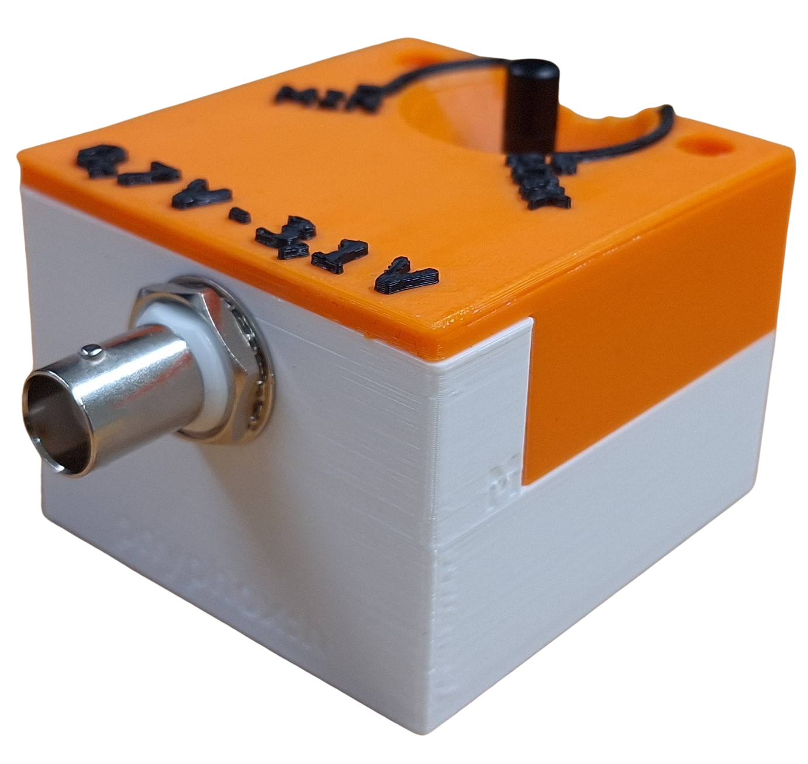
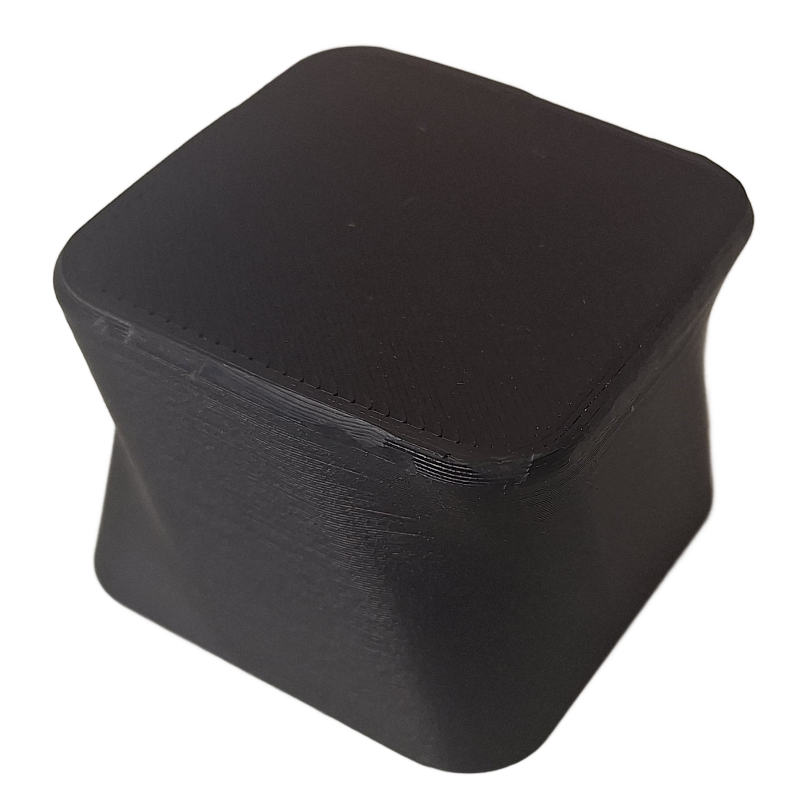
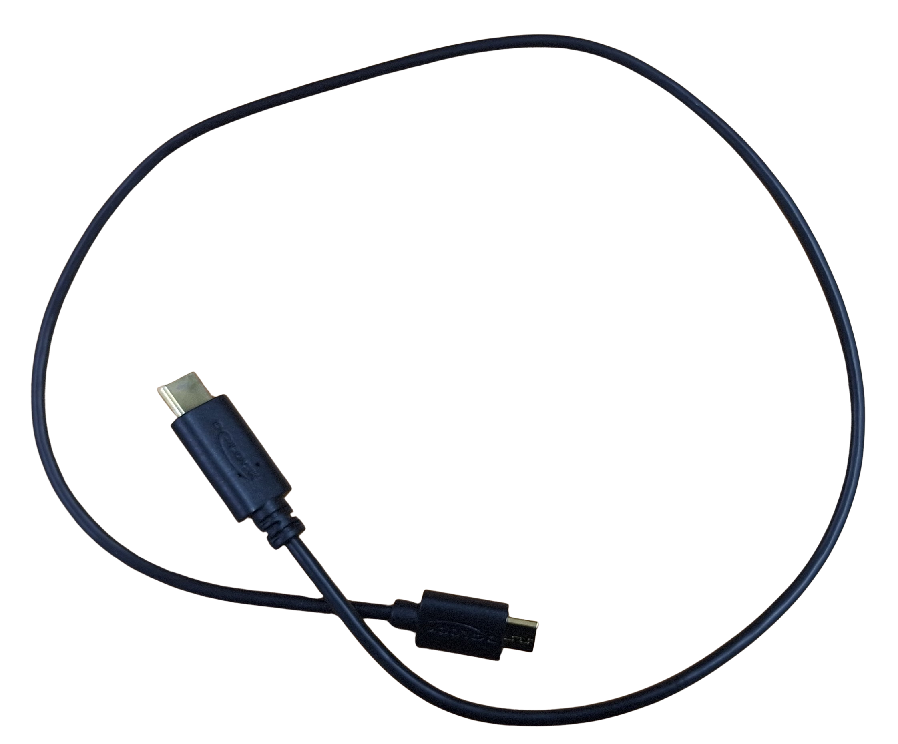
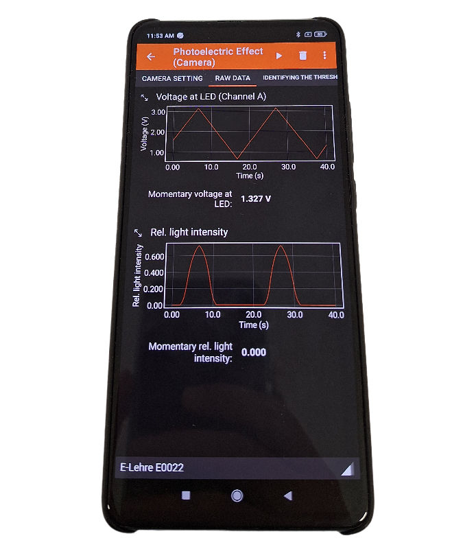

# - Setup and Execution -

## Materials
| | | |
|:-------------------------:|:-------------------------:|:-------------------------:|
| *phyphox*:h box |  Blackout box |  Support element|
| Various LED insets |  Connector cable |  Smartphone |

## Setup
1. Download the *phyphox* experiment **PLA** (Planck constant) using the QR code below.
  - Open the *phyphox* app.
  - Click on the plus symbol.
  - Select "Add experiment from QR code".
  - Scan the QR code below.
2. Connect the blackout box with the *phyphox*:h box.
3. Connect the *phyphox*:h box with the power supply (e.g., the smartphone)

{width=20%}

## Execution
1. Open the *phyphox* experiment **PLA**.
2. Select your *phyphox*:h box (numbering on the side of the box). \[Rightarrow\] Now the box connects to the app an begins to send the absolute value of the voltage applied.
3. Place your smartphone on the blackout box so that the smartphone camera is situated directly above the reflective material (white). Use the support element if necessary.
---
4. Insert the LED inset into the blackout box.
5. Set the voltage control dial of the *phyphox*:h box to the maximum. Set the selection rectangle of the camera so that *no selected area is overexposed* (i.e. the selection rectangle *must not contain any areas marked red*).
6. Turn back the voltage control dial and switch to the tab "Identifying the threshold voltage".
7. Start the measurement
8. Record a characteristic curve of the LED by *slowly* turning the voltage control dial. *Alternatively, you can also try the sawwave mode, in which the characteristic curve is automatically traced from left to right*.
9. Pause the measurement when you have recorded a usable characteristic curve.
10. Place the green line of best fit *by adjusting the minimum and the maximum light intensity taken into account*. The line of best fit should run through the linear part of the characteristic curve.
11. Write down the treshold voltage \[U_\mathsf{threshold}\] calculated by the experiment on the analysis worksheet. Also write down the associated measurement uncertainty. Next, enter the wavelength into the *phyphox* experiment and save the *wavelength - threshold voltage* value pair. The value pair is now available in the "Measuring h" tab.
12. Delete the recorded measurement data by selecting the corresponding button and start again at step 4 with a different LED.

## Analysis
1. Calculate the photon energies (including uncertainties) from the treshold voltages. *Reminder*: \[e=1.602\cdot 10^{-19}\,\mathrm{C}\]
2. Plot the obtained frequency-energy value pairs in the corresponding diagram on the analysis worksheet (including uncertainties).
3. Plot an approximate line of best fit in the diagram and determine its slope. What is the physical significance of the slope?
4. Plot a line with minimum slope an a line with maximum slope (within the uncertainties).
5. Calculate the uncertainty on the value obtained for the Planck constant.

## Problems and Solutions
- **The Bluetooth connection is interrupted** Close the *phyphox* app and restart the *phyphox* experiment.
- **The characteristic curve shows a hysteresis** This is often the case if the voltage is varied to quickly. Delete the measurement curve by selecting the corresponding button and restart the measurement.

## Worksheets / materials
- Analysis worksheet: [pdf](files/measuring_h_analysis.pdf)
  
