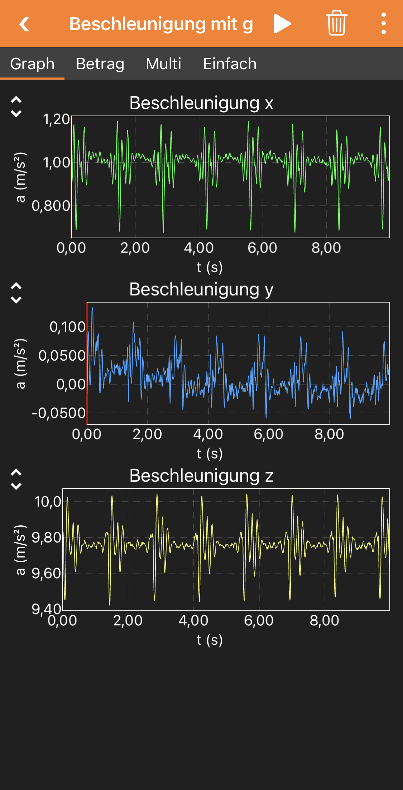
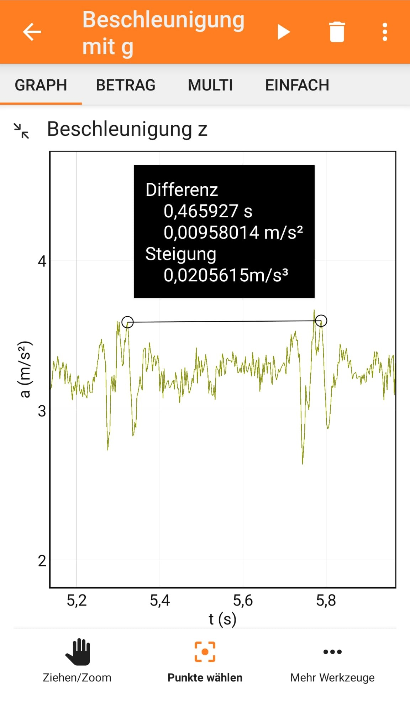

## Overview

The phone's accelerometer is sensitive enough to register and clearly visualize a heart beat. A participant simply needs to lie on their back and hold still with the phone is placed on their chest. This simple setup allows determining the heart beat and explore how it slows during resting periods (category biology) or it can be used to introduce students to the concept of frequency and periods for periodic processes (physics classes, mechanics in particular).

*Note that phyphox also supports reading out generic pulse meters using Bluetooth Low Energy simply by searching for Bluetooth devices via the plus menu on the home screen. This is not covered in this article.*

### Topics covered

This experiment can be used as a simple means to monitor someone's heart rate (for demonstration purposes not for medical applications) or as a simple illustration of periodic signals.
- The simple setup is good enough to see changes in the pulse frequency as the participant is in a resting position. However, periods have to be read manually (see below) and it will not be usable to monitor the heart rate during physical activities.
- The heart rate can be an introduction to periodic processes in which students learn the concepts of frequency and period by measuring the heart beat's period and calculating a frequency. This typically includes conversion between Hz and beats per minute.

### Required materials

Only a smartphone or tablet with phyphox is required.

### Time effort

No preparation required and the measurement can start immediately. Allow for a minute of measuring to give the participant a moment to calm.

## Setup

The participant needs to lie down on their back. The phone is placed on their chest.

## Execution

Select "Acceleration with g" from the phyphox main menu. Optionally, set a countdown by selecting "Timed Run" from the menu in the top right corner. A countdown of three seconds helps to avoid recording the touch when starting the measurement and the duration should be long enough to complete the measurement (for example 30s). Press the triangle to start the measurement while the phone is already on the participant's chest. Either wait for the measurement to stop (if a countdown is used) or carefully stop the measurement while avoiding to introduce an additional signal from your touch.

## Data analysis

You can measure the period between two heart beats by tapping on a graph with a clear signal (typically the z axis). Zoom in using two-fingure gestures to cover the relevant peaks within the graph. Then tap on "Pick data" at the bottom. Now you can touch one peak and drag a line to another peak by keeping your finger down and lifting it at the target peak. Phyphox will show the time difference in seconds. You can either pick neighboring beats to directly get the period or take into account multiple beats and calculate the mean period by dividing the time difference by the number of periods covered.

## Results

{width=50%}

{width=50%}

## Problems and Solutions

* **The signal is very weak**
  Avoid particularly thick and soft clothing (i.e. the participant should wear a T-Shirt rather than a thick pullover). Placing the phone on the participant's rib cage rather than on soft tissue will help further.

## Worksheets / material

No worksheets are available yet. You can check this page in other languages to see if there is material available for translation.

We are always happy to receive and share your worksheets. Get in touch with us at contact@phyphox.org
