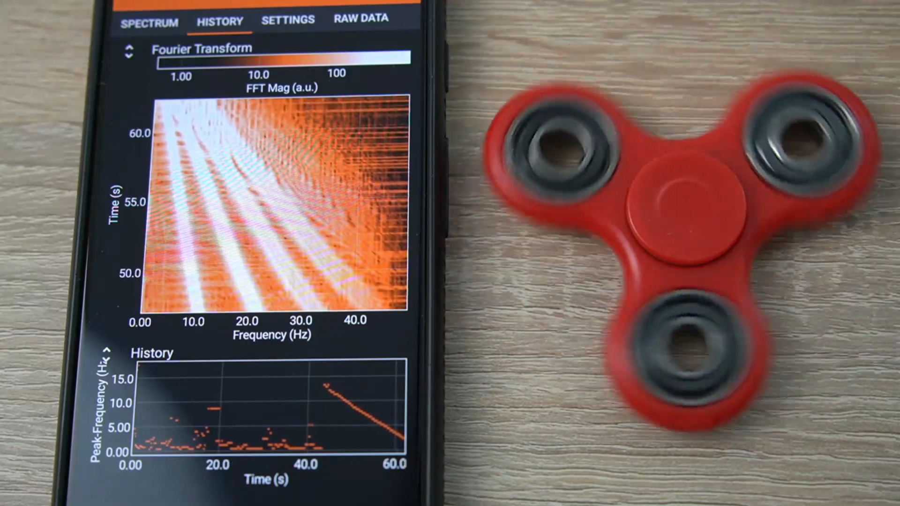



## Overview

This guide describes various methods for determining rotational speed using phyphox. In this case, it is less of a standalone experiment and more of a tool that can be used for analyzing other experiments or even for everyday applications.

To determine the rotational frequency, you can use the accelerometer, magnetometer, microphone, or camera. Which of the four methods is best depends on the object or device to be measured, the speed of rotation, and the required resolution.

{width=80%}

### Covered Topics

From a physics perspective, this is not a standalone experiment. Rather, it is a measurement tool that can be used in a variety of experiments across different age groups and topics. The method itself can also be a subject of classroom discussion. The examples mentioned here can illustrate the Fourier transform and demonstrate its limitations and special features, such as the aliasing effect.

### Required Materials

The only thing required for the methods presented here is the smartphone itself. Depending on the context and the sensor used, a permanent magnet (for magnetometer measurements) or a tripod (for camera measurements) can be a useful addition. Of course, in all cases, the rotating setup or apparatus to be measured is also required.

### Time Required

Adding rotational speed measurement using phyphox can be done in just a few minutes. Depending on the method, it may take some time to find the ideal measurement position, method, and/or correct parameters. Therefore, it is generally recommended to test the method in advance.

## Setup

The setup depends on the physical property through which the rotational speed is to be determined.

### Measurement Using the Accelerometer

If the rotation creates a vibration, even a very slight one, using the accelerometer can be an effective method. The phone just needs to be placed in a way that it can vibrate along. It can be placed directly on the rotating device (e.g., washing machine or hard disk drive) or on the same surface. In most cases, the vibration frequency corresponds to the rotational frequency. Exceptions include combustion engines, where vibrations are dominated by the cylinder strokes, resulting in a frequency that is a multiple of the actual rotational speed.

The maximum measurable frequency depends on half the sampling rate of the accelerometer in the respective smartphone model. Typically, iPhones allow measurement up to 50 Hz (3,000 rpm), and many Android devices go up to 250 Hz (15,000 rpm).

{width=80%}

### Measurement Using the Magnetometer

If the vibration is insufficient or the smartphone cannot be practically placed at the vibration source, a magnetic measurement can be a good alternative. This requires a periodic change in the magnetic field with the rotation. This occurs naturally in electric motors due to their design, but can also be created by magnetizing ferromagnetic parts of the setup (e.g., metallic masses of a fidget spinner) or attaching a small magnet (as commonly done to bicycle spokes for bike computers). Depending on the field strength, the phone can be placed at a considerable distance from the rotating object. Note that most smartphone magnetometers saturate at a few millitesla, which can introduce strong harmonics in the spectrum (see "Problems and Solutions" below). Proper placement of the magnet and phone is therefore essential.

The maximum measurable frequency is determined by half the sampling rate of the magnetometer. Typical measurable frequencies are 25 Hz (1,500 rpm) or 50 Hz (3,000 rpm).

### Measurement Using the Microphone

The microphone is another option if the rotation generates a sound that stands out from ambient noise. This is typically the case when changes in speed are accompanied by audible pitch changes. The phone should ideally face the setup with the microphone and not be placed on surfaces that could transmit unrelated noise.

The maximum measurable frequency is determined by half the microphone's sampling rate, which is 48,000 Hz on nearly all smartphones. This theoretically allows for measuring speeds up to 24 kHz. In practice, low frequencies are often poorly captured, and achieving sufficient resolution at such high sample rates requires a large number of data points. Therefore, the microphone is most useful when the rotational speeds are too high for the accelerometer.

### Measurement Using the Camera

If the rotation is visible, the smartphone camera can be a simple alternative for measuring rotational speed. A spot must be visible where brightness changes periodically with rotation. If this is not naturally the case, it can easily be added using a pen or a piece of colored tape. A tripod is recommended, as the measurement position within the camera frame needs to remain fixed.

The maximum measurable frequency is determined by half the frame rate of the camera. This is not necessarily the highest frame rate used for slow-motion, but rather the highest frame rate that can be used for real-time analysis by the app. iPhones can reach 240 frames per second, equivalent to 120 Hz (7,200 RPM). On Android, the current limit is 60 frames per second and 30 Hz (1,800 RPM).

## Execution

For each chosen measurement method, open the corresponding configuration in phyphox, which will display the spectrum of measured values (see subsections below). Start the measurement with the triangle icon at the top right. All configurations display the current frequency spectrum, in which the rotational frequency should appear as a peak. Another tab shows the time evolution of the spectrum and the dominant frequency. By selecting a higher or lower number of data points in the "Settings" tab, you can optimize the trade-off between response time and frequency resolution (more in the "Results" section).

### Using the Accelerometer

The configuration for determining rotational speed with the accelerometer is under "Tools" -> "Acceleration Spectrum".

### Using the Magnetometer

The configuration for determining rotational speed with the magnetometer is under "Tools" -> "Magnetic Spectrum".

### Using the Microphone

The configuration for determining rotational speed with the microphone is under "Acoustics" -> "Audio Spectrum".

### Using the Camera

The configuration for determining rotational speed with the camera is under "Camera" -> "Camera Spectrum: Brightness".

## Results

All configurations presented here use a Fourier transform of the sensor data. This means that the measured signal is decomposed into a sum of sine functions of various frequencies. The displayed spectrum shows the amplitude of each sine wave present in the signal.

In many cases, it is sufficient to read off the frequency with the highest amplitude. However, it's important to understand the limitations of this method.

The frequency axis of the Fourier spectrum always ranges from 0 Hz to half the sampling rate \(f\) of the signal. For example, if you measure with an accelerometer at a sampling rate of \(f = 400\,\mathrm{Hz}\), the spectrum will cover 0 to 200 Hz (see [sampling theorem](https://en.wikipedia.org/wiki/Nyquist%E2%80%93Shannon_sampling_theorem)). The sampling rate is determined by the device, so there is nothing we can do about this range.

The number of points along the frequency axis equals half the number of recorded samples \(N\). If 256 samples are recorded, the 200 Hz range will be divided into 128 spectrum points. This defines the spectral resolution, which is given by the sampling rate divided by the number of points: \(\Delta f = f/N\). In this case, the spectrum has points spaced about 1.56 Hz apart.

Since the recording duration of the measurement is \(T = N/f\), the spectral resolution can also be seen as the inverse of this duration: \(\Delta f = 1/T\). In the above example, it takes 0.64 seconds to collect 256 data points, which is the inverse of the spacing of 1.56 Hz.

This creates a trade-off between response time and frequency resolution. For constant rotation speeds, you can use many data points to achieve a high frequency resolution. For changing speeds, you may have to stick to fewer points to detect variations quickly, which will reduce the resolution of the frequency spectrum.

Additionally, some properties of the Fourier transform must be considered if the signal is not sinusoidal or if the rotation frequency exceeds the spectrum range. See "Problems and Solutions" below.

## Problems and Solutions

Since this is a tool for an unknown experimental setup, the following only covers problems specific to Fourier analysis.

### Multiple Frequencies Visible

The Fourier spectrum breaks the signal into sine components. If the signal is not purely sinusoidal, it cannot be represented by a single sine wave. Typically, this results in a peak at the fundamental frequency and additional peaks at higher harmonics. These can be ignored when determining rotational speed. However, with signals strongly deviating from a sine wave (e.g., a magnet on bike spokes or a small colored mark on a large wheel), harmonics may dominate and base frequency can easily be overlooked.

{width=80%}

### Slow Rotations

If the rotation speed is far below the sensor's sampling rate, the inverse relationship between frequency resolution and measurement duration becomes inefficient. Many data points are processed for a signal that might be better analyzed with simple timing between event thresholds. In these cases, phyphox's stopwatch functions are a better alternative.

For example, if you want to determine the rotational speed of a very slowly rotating bicycle tire by marking a spot with a bright sticker, you will get a spectrum where the rotational speed is close to 0 Hz, and the spectrum is overlaid with many overtones due to the signal deviating significantly from a sinusoidal shape. Additionally, in order to achieve a meaningful frequency resolution, relatively many rotations need to be measured. The stopwatch function, on the other hand, measures the time between crossing a predefined threshold and can thus accurately determine the time period from a single rotation. The stopwatch functions in phyphox provide a "Many" tab, which allows you to capture an unlimited number of such intervals and also calculate an average rate (in this case, the rotational speed).

### Rotations Too Fast

If the frequency to be measured is higher than half the sampling rate of the sensor, it may still appear in the spectrum, but at an incorrect value. This is known as [aliasing](https://en.wikipedia.org/wiki/Aliasing). This effect can produce spectra that appear to show a successful measurement but actually display a completely incorrect value. Therefore, it's important to be aware of the relationship between the expected frequency and the sensor's sampling rate. (See the "Setup" section for the measurement range of each sensor.)

{width=80%}

### Frequency Resolution Too Low

To achieve a higher frequency resolution, the number of data points considered must be increased in the "Settings" tab. However, this always involves a trade-off with the response time of the spectrum. (See the "Results" section for more details.)

## Additional Videos

The video embedded above is part of a three-part series on frequency analysis with phyphox. The series is not limited to rotational motion and also includes demonstrations using the microphone, magnetometer, and accelerometer.

Part 1: Audio (Mostly musical instruments, but applicable to rotations)



Part 2: Magnetism



Part 3: Acceleration (already embedded at the top)


