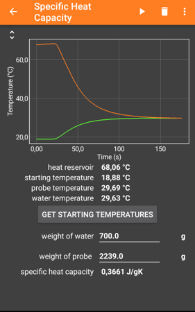
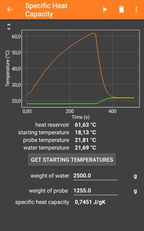

# Specific heat capacity
## Summary
This experiment enables the measurement of the specific heat capacity of an unknown material. To do so, the unknown sample is placed in a heated water basin. The specific heat capacity can be calculated from the resulting mixing temperature and the start temperature of the water and the sample.
## Materials

- 2 jars with water
- hot plate with magnetic stirrer (to minimize an temperature gradient inside the jar)
- tripod
- phyphhox-Thermodynamics board (which requires the satellite board aswell)
- scale
- cord

## Setup
Both jars have to be filled with a known amount of water. The first water filled jar is used to heat up the probe evenly. The second jar contains water at a lower temperature. Attach one temperature probe inside or on the sample and the second one in the cooler jar. Place a tripod above the water jars to be able to hang the sample inside the water jars with a thread. 

Scan the following qr-code for the phyphox-experiment:

## Measurement
Open the phyphox experiment and enter the respective data (amount of water and weight of sample) Heat up the sample inside the first jar. Wait until the temperature stays at a constant level before hanging the sample in the second jar. Start the phyphox experiment and press "Begin Measurement" before swapping the hot probe into the cooler water jar. The temperature of the probe and the water equalize over time. After the temperature has equalized, phyphox displays the calculated specific heat capacity.

## Analysis
The specific heat capacity $c_1$ of the unknown sample can be calculated by

$$c_{sample} = \frac{c_{water} \cdot m_{water} \cdot (T_{mixed} - T_{water})}{m_{sample} \cdot (T_{sample} - T_{mixed})}$$
where $c_{water} = 4.19 \frac{kJ}{kg \cdot K}$ the specific heat capacity for water represents.

## Supplementary (e.g. Working Sheets)

## Examples
### Result for copper

### Result for graphite

## Experiment Variants
The experimental setup can be used for various materials such as copper or graphite.

## Troubleshooting
To improve the measurement results, try to insulated the water jars as much as possible.

## Literature and Source
- Mechanics and Thermodynamics, Wolfgang Demtröder (ISBN: 978-3-319-27877-3)
